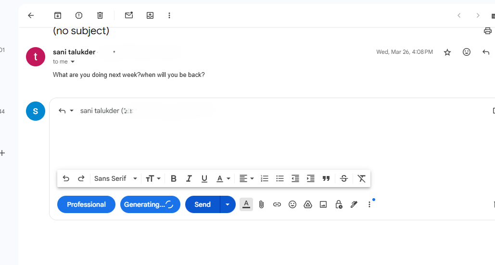
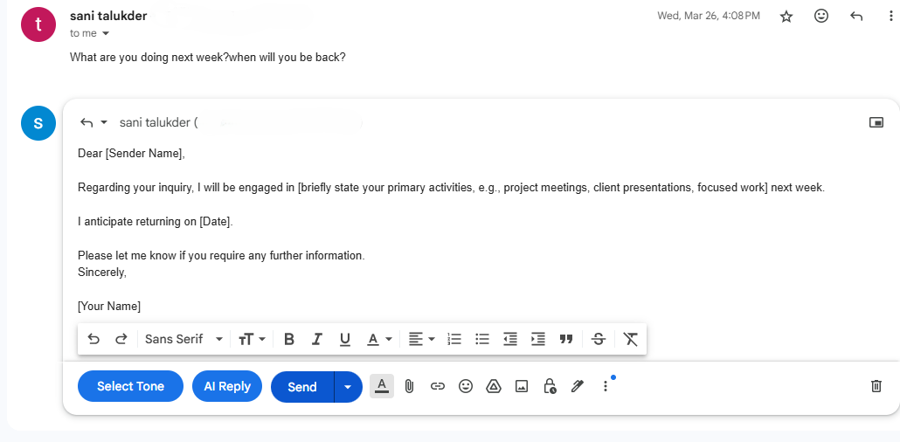
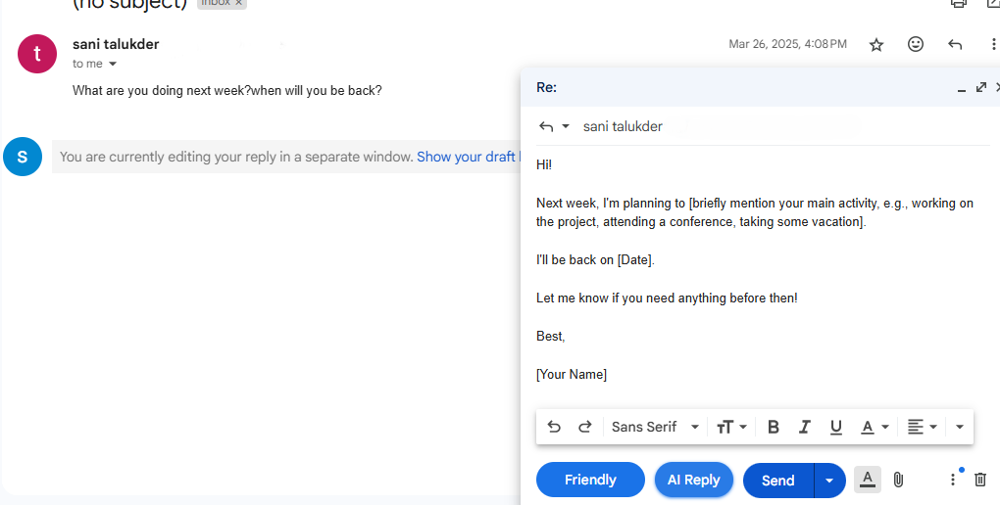

# Email Assistant 

This is an Email Assistant application. It provides an API to generate email responses using external services. The application is built with Spring Boot and can be containerized using Docker. Additionally, it includes a Chrome extension for seamless integration, allowing users to interact with the backend directly from their browser.

---

## Features
- REST API for generating email responses.
- Environment variable support for external API configuration.
- Dockerized for easy deployment.
- Chrome extension for seamless integration.

---

## Prerequisites
- **Java 17** or higher (if running the backend locally)
- **Maven** (for building the project locally)
- **Docker** (for containerization, if needed)
- **Google Chrome** (for the extension)

---

## Setup Instructions

### 1. Clone the Repository
First, clone the Git repository to your local machine:
```bash
git clone https://github.com/your-username/email-assistant.git
cd email-assistant
```

---

### 2. Load the Chrome Extension
The project includes a Chrome extension for interacting with the backend. Follow these steps to load the extension:

1. Open Google Chrome and navigate to `chrome://extensions/`.
2. Enable **Developer Mode** (toggle in the top-right corner).
3. Click **Load unpacked**.
4. Select the `extension` folder located in the cloned repository:
    ```
    email-assistant/extension
    ```
5. The extension will now be loaded and visible in your Chrome browser.

> **Note:** The backend is already deployed on Render, so you only need to load the extension to start using the application. If you prefer to run the backend locally, follow the steps below.

---

### 3. Configure Environment Variables (Optional)
If running the backend locally, the application uses the following environment variables for configuration:

| Environment Variable | Description                              | Default Value       |
|-----------------------|------------------------------------------|---------------------|
| `GEMINI_API_URL`      | URL of the external API                 | `default-url`       |
| `GEMINI_API_KEY`      | API key for authentication              | `default-key`       |

You can set these variables in your environment or pass them during runtime.

---

### 4. Build and Run the Backend (Optional)

#### Build the Project
Use Maven to build the project and generate the JAR file:
```bash
mvn clean package
```

The JAR file will be located in the `target` directory.

#### Run Locally
Run the application locally using the `java -jar` command:
```bash
java -jar -DGEMINI_API_URL="your_url" -DGEMINI_API_KEY="your_key" target/email-helper-0.0.1-SNAPSHOT.jar
```

#### Run with Docker

##### Build the Docker Image
```bash
docker build --build-arg JAR_FILE=email-helper-0.0.1-SNAPSHOT.jar -t email-assistant .
```

##### Run the Docker Container
```bash
docker run -d --name email-assistant-container -p 8080:8080 \
  -e GEMINI_API_URL="your_url" \
  -e GEMINI_API_KEY="your_key" \
  email-assistant
```

---

## API Endpoints

### `POST /email/generate`
Generates an email response based on the provided request.

#### Request Body:
```json
{
  "emailContent": "string",
  "tone": "string"
}
```

#### Response:
- **200 OK**: Returns the generated email response.
- **500 Internal Server Error**: If an error occurs during email generation.

---

## Project Structure
```
email-assistant/
├── backend/
│   ├── src/
│   │   ├── main/
│   │   │   ├── java/
│   │   │   │   └── com.example.email_helper/
│   │   │   │       ├── controllers/
│   │   │   │       │   └── EmailGeneratorController.java
│   │   │   │       ├── dtos/
│   │   │   │       │   └── EmailRequest.java
│   │   │   │       └── services/
│   │   │   │           └── EmailGeneratorService.java
│   │   │   └── resources/
│   │   │       └── application.properties
│   ├── Dockerfile
│   └── pom.xml
├── extension/
│   ├── manifest.json
│   ├── background.js
│   ├── popup.html
│   └── popup.js
```

---

## Logging
The application uses `Slf4j` for logging. Logs are printed to the console and include information about email generation success or errors.

---

## Preview





---

## Contact
For questions or support, please contact [sanitalukder1998@gmail.com].